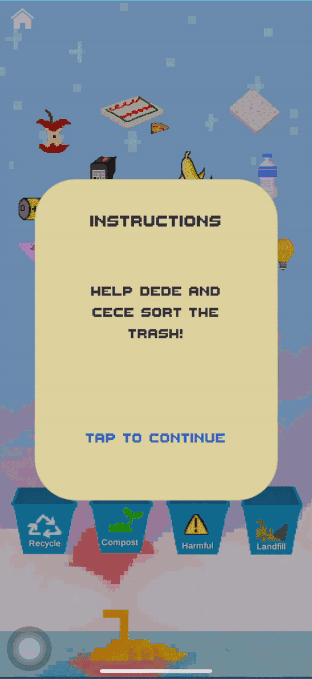

# Mission Ecopossible
## Introduction

This app was created by ECOders, a team consisting of Anisha Kabir, Fan Wang, Karen Ly, and Zhuofan Li, who participated in Dandilyonn’s 2020 SEEDs program. Mission Ecopossible is an interactive mobile game that seeks to educate users about ocean pollution and the proper disposal of waste.

Check out our website! 
https://missionecopossible.weebly.com/

Technical Coach: Ravin Jain 

Graphics designed by: Fan Wang

### Technologies Used: 
Built with C#, Unity

## Features
### Loading Scene
Between several scene changes, there will be a loading scene with fun facts or tips about recycling.

### Dialogue Scene
For each level of chapter 1, the player interacts with the main characters (Dede, Bebe, and Cece) and learn more about their unique stories.

### Submarine Game
In levels 2, 3, and 4, the player controls a submarine to help the main characters collect garbage. By pressing and holding down on the screen, the player can extend the claw of the submarine to grab each new item. Each time a trash item is collected, its name and category is displayed for the player to remember. 

### Sorting Game 
After the player collects the garbage at levels 2, 3 and 4, the player sorts all of them at level 5. By dragging the garbage item into the corresponding trash bin, the player can enhance their sorting knowledge they learned in the submarine game in levels 2, 3 and 4. A reminder will pop up if the garbage item is not placed in the correct trash bin.

## Installation

Coming soon!

### App Store

## Building

### With UnityHub and Unity Editor

This project requires the [Unity Hub](https://unity3d.com/get-unity/download) to be installed in your development environment. 
In addition, you will need to download the Unity Editor ([**Unity 2019.2.3f1**](https://unity3d.com/get-unity/download/archive)) and install it 
with iOS Build Support or any other module according to your device. Then you need to add the Unity Editor you just downloaded into your Unity Hub.

1. Open Unity Hub
2. Select 'Installs' 
3. Click 'Locate' and add the Editor
4. If you don't find the module you want, click the three dots to the right of the version label, then click 'Add Modules'
5. Select all the Modules you want
6. Click 'Done'

After installing the correct component, you can build and export the game inside the Unity Editor now.

1. Open Unity Hub
2. In the 'Projects' panel, click 'Add' and find this project on your computer
3. Open the project you just added
4. Open 'File'
5. Select 'Build Settings'
6. Choose the platform you want to build on, click 'Build'
7. Make sure you installed the Build Support for the platform you choose

Then, Unity will build the game for you.

## Features In Progress
- Track player's progress through different chapters and levels
- Create a better badges panel that updates everytime the user completes a chapter
- Implement a working restart button in settings page to delete all of user's progress
- Lock uncompleted levels
- Improve loading page for smoother transition
- Create more characters and maps for future chapters
- Add time limit and leadership board for mini games
